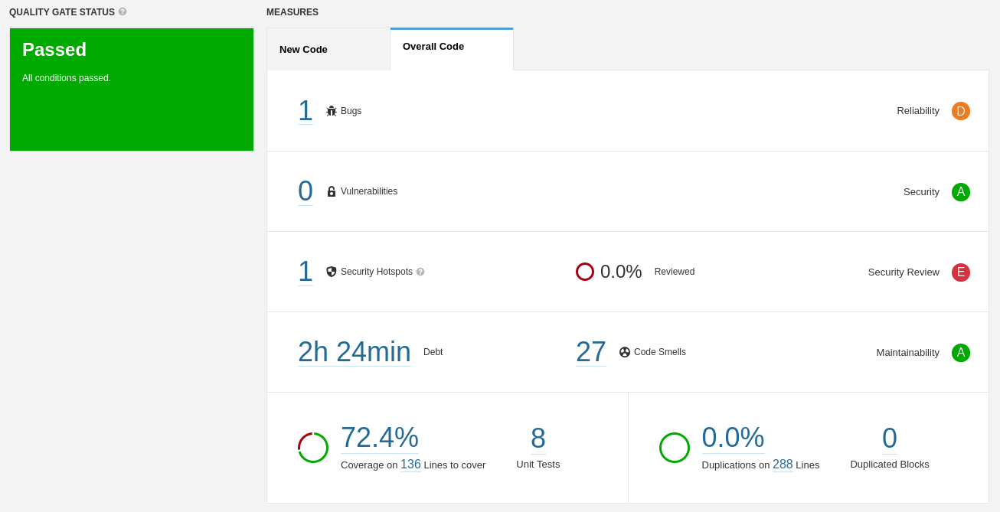

# Lab 6.2

## SonarQube analysis of the Lab 2.1 project "Euromillions"

Analysing the project with SonarQube yields the following results:

At first glance, it seems that the project passed the quality gate, as the interface tells us in the left side.

The project is using the default SonarQube quality gate settings, which stipulate that a passing project must have over 80% code coverage and rank A reliability on new code, among other criteria. However, this is for new code increments only, no conditions are set for the overall code. As such, this newly imported project has passed the gate regardless of its measures.

Should a custom quality gate be defined that includes conditions for the overall code, it may fail depending on what thresholds we set for each measure.

<table>
<theader>
<tr>
<th>Issue</th><th>Problem description</th><th>How to solve</th>
</tr>
</theader>
<tbody>
<tr>
    <td>
        Bug (Critical)
    </td>
    <td>
        "Random" objects should be reused
    </td>
    <td>
        Save the Random object and use it instead of creating a new one everytime a random number is needed
    </td>
</tr>
<tr>
    <td>
        Security Hotspot
    </td>
    <td>
        Weak Cryptography
    </td>
    <td>
        Make sure that using a pseudorandom number generator is safe
    </td>
</tr>
<tr>
    <td>
        Code Smell (Major)
    </td>
    <td>
        Standard outputs should not be used directly to log anything
    </td>
    <td>
        Use a logger instead of standard output
    </td>
</tr>
<tr>
    <td>
        Code Smell (Major)
    </td>
    <td>
        JUnit assertTrue/assertFalse should be simplified to the corresponding dedicated assertion
    </td>
    <td>
        Use `Assert.assertEquals(a, b)` rather than `AssertTrue(a.equals(b))`
    </td>
</tr>
<tr>
    <td>
        Code Smell (Major)
    </td>
    <td>
        "for" loop stop conditions should be invariant
    </td>
    <td>
        Refactor the code so that the stop condition is not changed within the loop (in this case, doing a conditional "i++" inside the loop)
    </td>
</tr>
</tbody>
</table>
