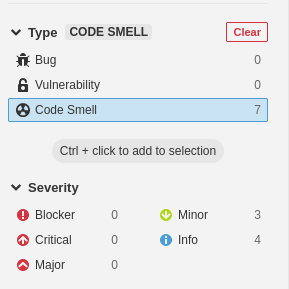

# Lab 6.3 - "Cars" project analysis

## a)

These are the results of the initial analysis:

The technical debt found is 25min, meaning that to fix all the issues found, SonarQube estimates that it would take 25 minutes, a very low value as the only issues found were 8 code smells.

## b)

The analysis revealed only one severe code smell (a blocker): an empty test.

This test has no purpose, and seems to be a leftover from auto-generated code. Simply deleting this file will fix the issue.

Scanning the project once more, we get this:

No more severe code smells.

Something to note is that the cars project being analysed already made use of a Data Transfer Object, avoiding the "Persistent entities should not be used as arguments" vulnerability.

## c) & d)

After adding the Jacoco plugin to the project and running the analysis again, we have the following results:

The tests have 50.4% coverage, leaving 36 lines to be covered, and 20 conditions to cover. The majority of these seem to be in getters and setters, as well as `hashCode` and `equals` methods.