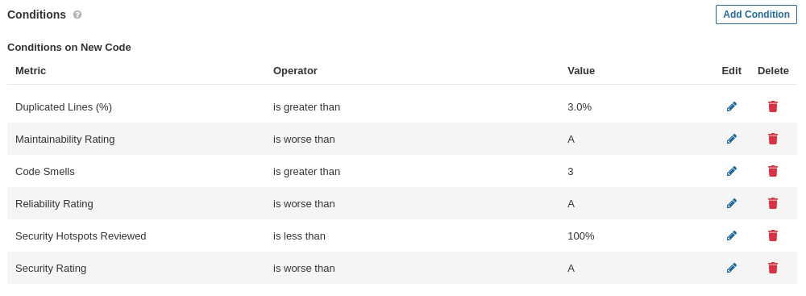

# Lab 6.4 - SonarQube analysis on IES project backend API

The initial analysis for the project, using the default quality gate:

## a)

The following gate was created, based on the default gate but with coverage conditions removed and a code smells conditions added:

## b)

The following changes were made to the code:

Running the analysis again produces the following results:

The new code fails to pass the custom quality gate as it violates the "Code Smells greater than 3" condition.

Here are the code smells introduced by the new code:

